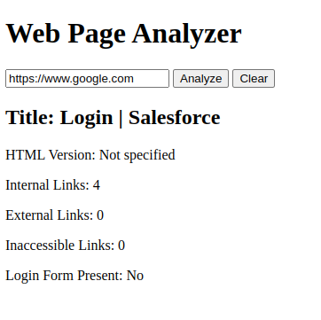

# Web Page Analyzer

This project is a web application that does an analysis of a web-page/URL.

### Running project with Docker

Ensure that you have Docker Engine installed locally. Refer to platform specific instructions.

1. `docker compose build`
2. `docker compose up -d`

To view the web page: <http://localhost:5000>.
